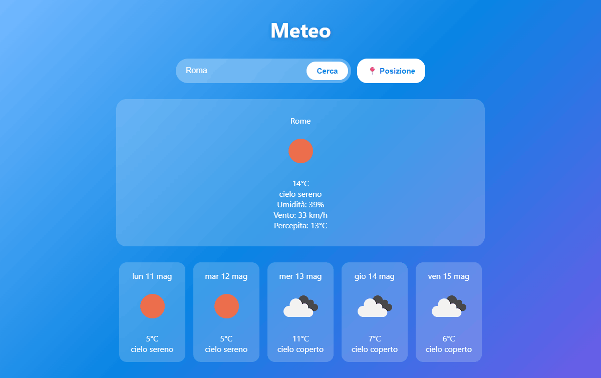

# 🌤️ Weather Dashboard

A responsive weather dashboard built with HTML, CSS and vanilla JavaScript.

## 🚀 Live Demo
> No live demo available — API key required. See setup instructions below.

## ✨ Features
- Search weather by city name
- Geolocation support — get weather for your current position
- Current weather: temperature, description, humidity, wind speed, feels like
- 5-day forecast with weather icons
- Error handling for invalid city names
- Responsive design for mobile devices

## 🛠️ Tech Stack
- HTML5
- CSS3
- JavaScript ES6+
- [OpenWeatherMap API](https://openweathermap.org/api)

## 📸 Screenshot

## ⚙️ Setup

1. Clone the repo

       git clone https://github.com/stefanopolidoro/weather-dashboard.git

2. Get a free API key from [openweathermap.org](https://openweathermap.org)

3. Copy `js/config.example.js` to `js/config.js` and add your API key

       cp js/config.example.js js/config.js

4. Open `index.html` in your browser

> ⚠️ **Note:** In a production environment, the API key should be stored server-side to prevent exposure in the browser.

## 📁 Project Structure

    weather-dashboard/
    ├── index.html
    ├── css/
    │   └── style.css
    ├── js/
    │   ├── config.example.js
    │   ├── config.js
    │   └── app.js
    └── README.md

## 📄 License
MIT